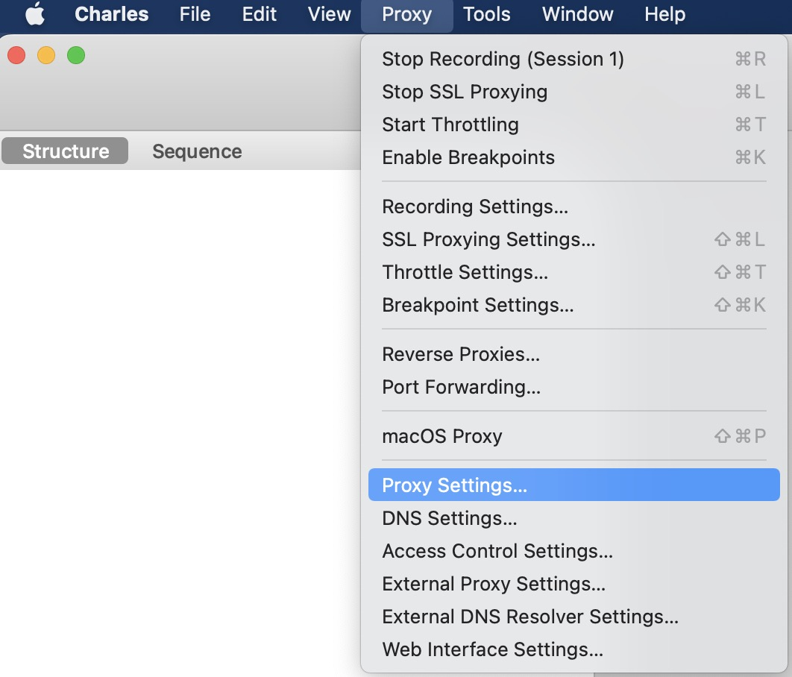
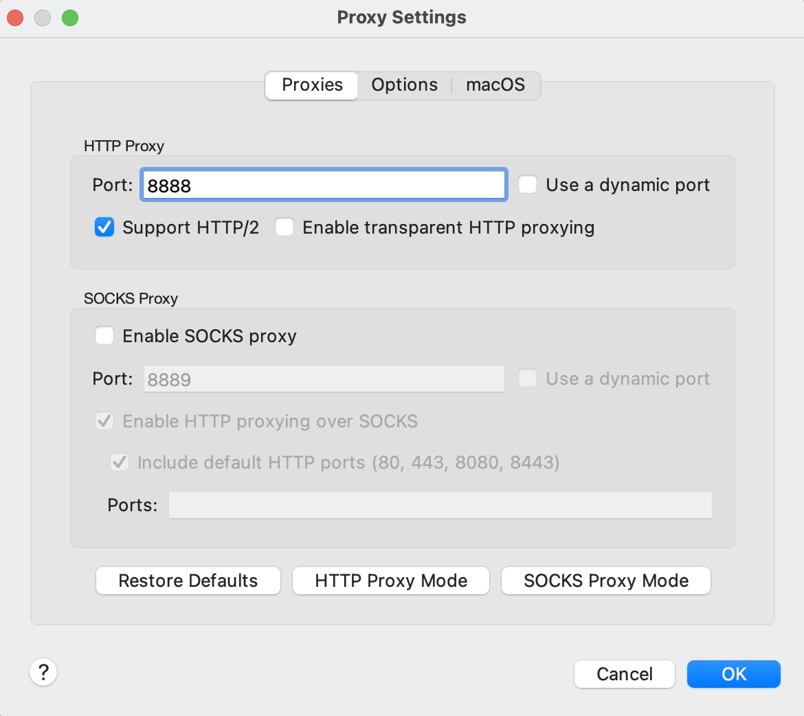
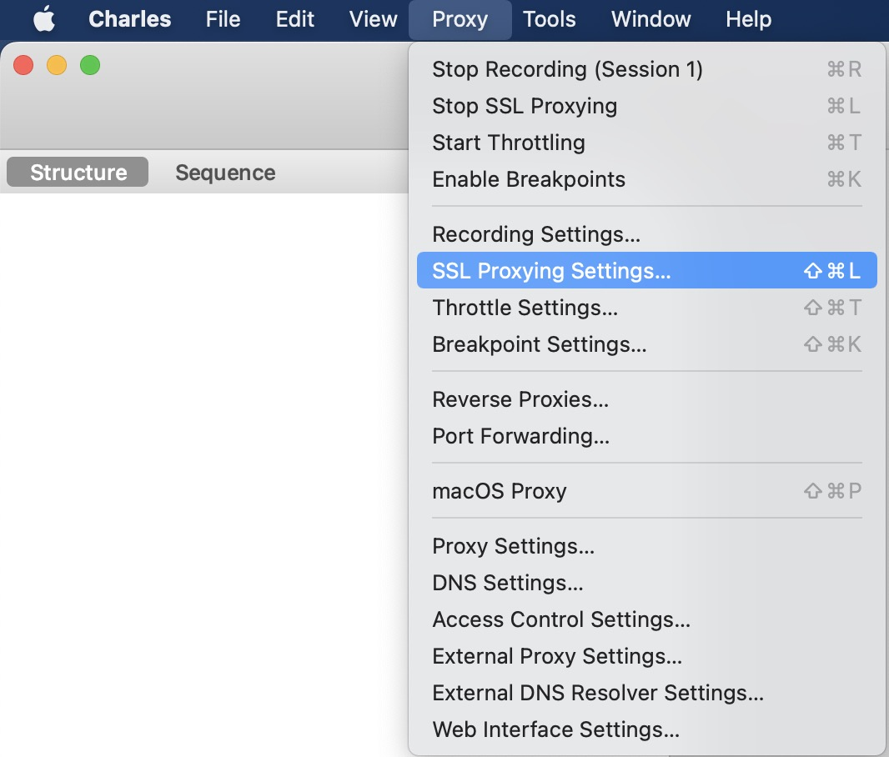
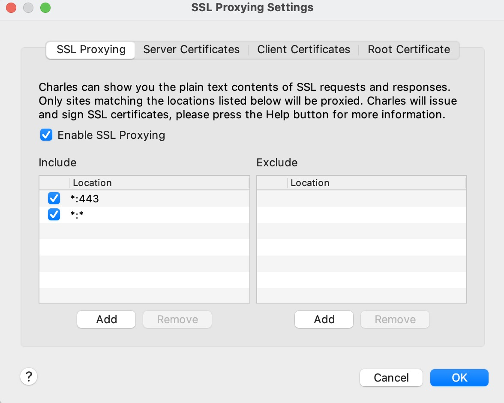
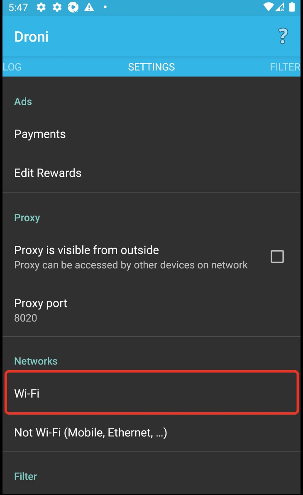
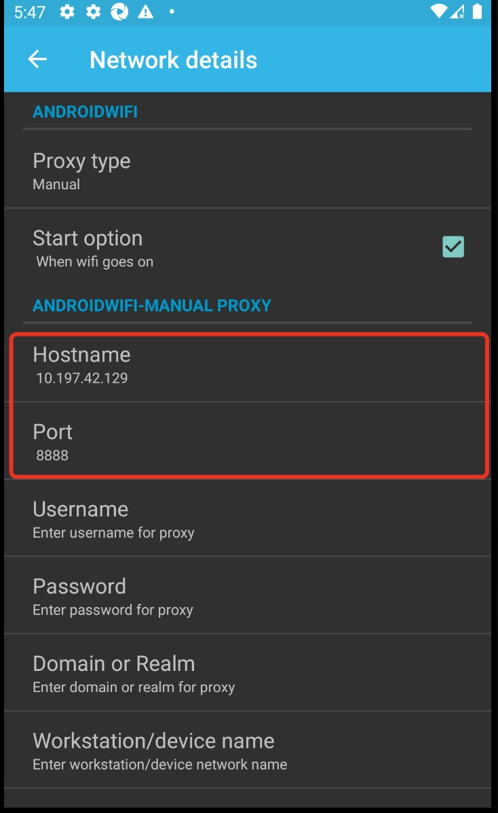
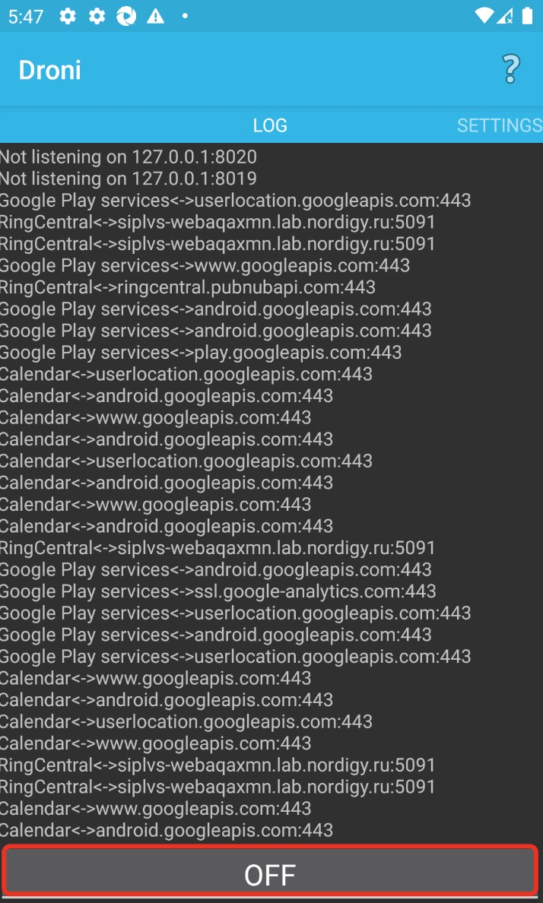
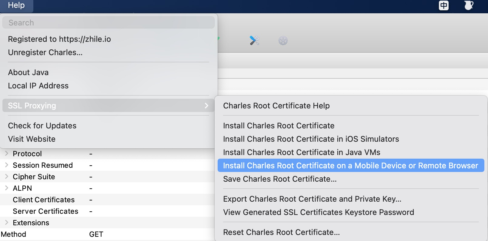
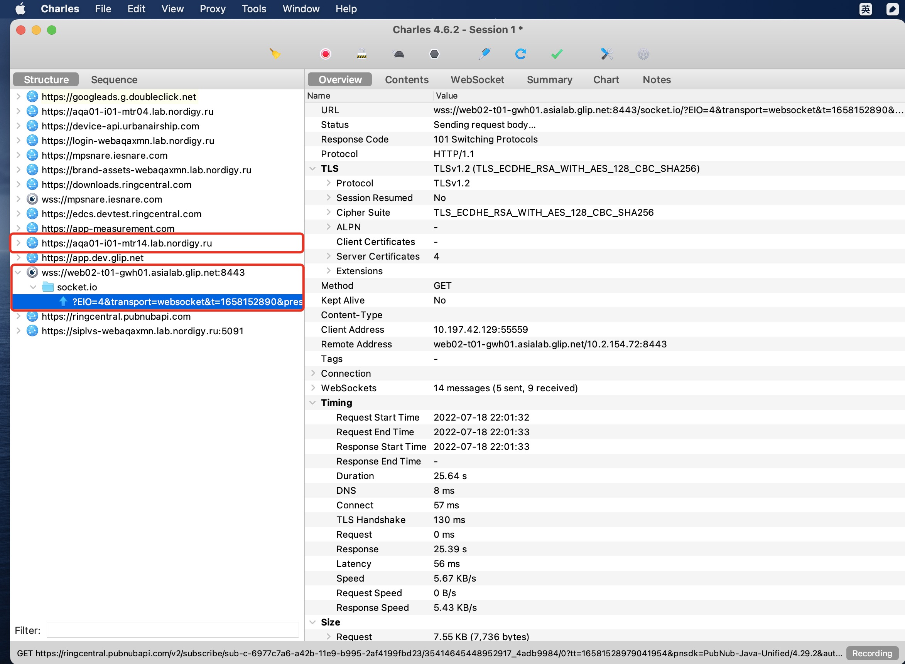

#### Charles

> <https://www.charlesproxy.com/latest-release/download.do>

```
help > Registered to
Registered Name: https://zhile.io
License Key: 48891cf209c6d32bf4
```

#### Proxy Setting



#### SSL Proxy Setting



#### Config Android Device Proxy
step 1: Download drony.apk on your android device
> <https://files-cdn.cnblogs.com/files/lulianqi/Drony_102.apk>

step 2: config drony.apk





step 3: Install Certificate on Android Device



step 4: login mThor, you can see http(s), websocket content in charles




