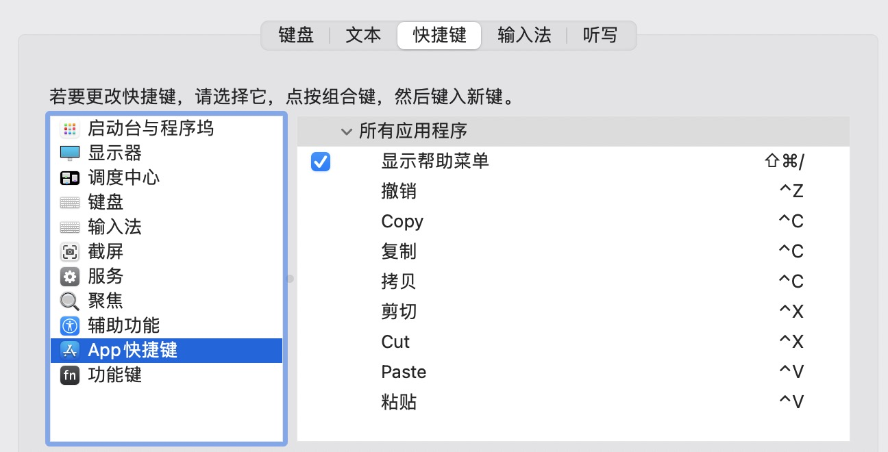

#### 程序坞图标排列


#### 快捷键配置



#### Finder显示隐藏文件

> defaults write com.apple.Finder AppleShowAllFiles YES

#### Git配置

```
配置commit用户名: git config --global user.name "username"
配置commit邮箱: git config --global user.email "useremail"
```

#### Idea配置

```xml
Preferences > 编辑器 > 字体: Droid Sans Mono 18
Preferences > 外观与行为 > 外观: 使用自定义字体 .AppleSystemUIFont 13
Preferences > 构建、执行、部署 > 编译器: 共享构建进程堆大小 2048MB

open /Applications/IntelliJ\ IDEA.app/Contents/plugins/maven/lib/maven3/conf/settings.xml
comment
<mirror>
  <id>maven-default-http-blocker</id>
  <mirrorOf>external:http:*</mirrorOf>
  <name>Pseudo repository to mirror external repositories initially using HTTP.</name>
  <url>http://0.0.0.0/</url>
  <blocked>true</blocked>
</mirror>
add
<mirror>
  <id>aliyunmaven</id>
  <mirrorOf>central</mirrorOf>
  <name>阿里云公共仓库</name>
  <url>https://maven.aliyun.com/repository/public</url>
</mirror>
```

#### 终端配置

```
Style: Homebrew
字体: Andale Mono 18
字符间距: 0.945
窗口大小: 列数80, 行数25
```

#### iTerm配置

```
Profiles > Text > Font Monaco 20 
General > Closing × Confirm closing multiple sessions × Confirm "Quit iTrem2"
```

#### WDA配置

```
open ~/.nvm/versions/node/v18.2.0/lib/node_modules/appium/node_modules/appium-webdriveragent/WebDriverAgent.xcodeproj
Product Bundle Identifier: com.ringcentral.WebDriverAgentRunner
```

#### GoldenDict配置

```bash
cd /Applications/GoldenDict.app/Contents
mkdir Youdao && cd Youdao
wget https://raw.githubusercontent.com/easeflyer/gd_plugin/master/youdao/yd_get.py
chmod +x yd_get.py
pip3 install requests
pip3 install lxml
编辑 > 词典 > 程序: /Applications/GoldenDict.app/Contents/Youdao/yd_get.py %GDWORD%
```