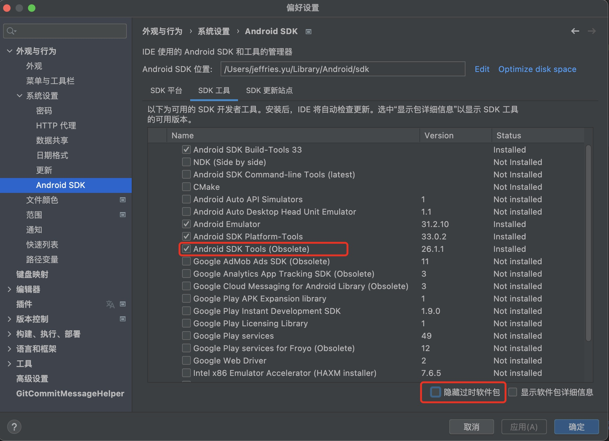

#### appium-hermes

> <https://git.ringcentral.com/jeffries.yu/appium-hermes.git>

#### Cordova安装配置

```bash
npm install -g cordova
cd HermesApp
brew install gradle
sudo gem install cocoapods
cd ~/Library/Android/sdk/tools/bin && .sdkmanager "build-tools;29.0.3"
cordova platform add ios
cordova platform add android
cordova requirements 
# should install lack requirements
# if requirements result is failed, resolve it and 
# delete platform dir and
# exec 'cordova platform add ios' && 'cordova platform add android' again
cordova build android
cordova build --emulator ios
cordova build --device ios
```
